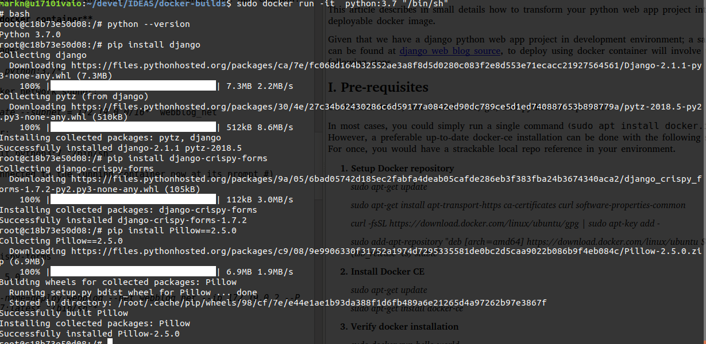
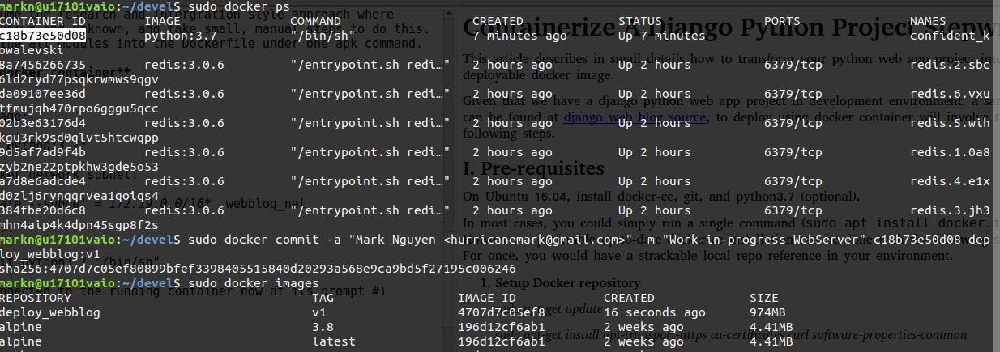
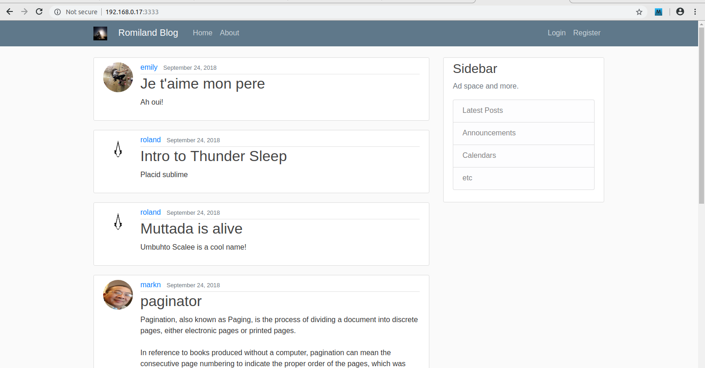

# Containerize A Django Python Project Stepwise
This article describes in small details how to transform your python web app project into a deployable docker image.


Given that we have a django python web app project in development environment; a sample can be found at [django web blog source](https://github.com/hurricanemark/django-web-blog-), to deploy using docker container will involve the following steps.

## I.  Pre-requisites 
On Ubuntu 16.04, install docker-ce, git, and python3.7.  


In most cases, you could simply run a single command (`sudo apt install docker.io`).  However, a preferable up-to-date docker-ce installation can be done with the following steps.  For once, you would have a strackable local repo reference in your environment.

 1. **Setup Docker repository**
     
    *sudo apt-get update*

    *sudo apt-get install apt-transport-https ca-certificates curl software-properties-common*

    `curl -fsSL https://download.docker.com/linux/ubuntu/gpg | sudo apt-key add -`

    `sudo add-apt-repository "deb [arch=amd64] https://download.docker.com/linux/ubuntu $(lsb_release -cs) stable"`

 2. **Install Docker CE**

    *sudo apt-get update*

    *sudo apt-get install docker-ce*

 3. **Verify docker installation**

    *sudo docker run hello-world*

 4. **Install local GIT**
 
    *sudo apt-get update*

    *sudo apt-get install git*

    *git config --global user.name "user_name"*

    *git config --global user.email "email_id"*    
> (Where user_name, email_id are from your GitHub registry.  If you don't have them, use local user name, and your email as references with respect to your local git settings only).


 5. **Install Python3.7**

    *sudo add-apt-repository ppa:jonathonf/python-3.7*

    *sudo apt-get update*

    *sudo apt-get install python3.7*

    *python --version*

    *sudo apt-get install -y build-essential libbz2-dev libssl-dev libreadline-dev libsqlite3-dev tk-dev*

    *sudo apt-get install -y libpng-dev libfreetype6-dev*

 
 6. **Pull source code from GitHub**

    *mkdir -p ~/devel/django-src*

    *cd ~/devel/django-src*

    *git clone https://github.com/hurricanemark/django-web-blog-.git*


## II. Build -- Start from a Base Docker image
Using a python3:7:latest docker image, we will walk through the mechanic of shaping up only the essential components to run a web application inside a container.  We would of course compile the followings into a Dockerfile at a later time.  But for the sake of understanding what it takes; Let's approach with small, manual steps.

 1. **Working with a docker container**


    1.1  Pull base image:

    *sudo docker pull python:3.7*

    1.2  Create a docker network subnet:

    *sudo docker network create --subnet=172.20.0.0/16 webblog_net*

    1.3  Run container:    

    *sudo docker run -it python3:7 "/bin/sh"*

    (You should be connected to the running container now at its prompt #)

    1.4  Install neccessary modules to run the web server:


    *bash*        

    *python --version*        

    *pip install django*        

    *pip install django-crispy-forms*
        
    *pip install Pillow==2.5.0*

    *pip install pyvim*

    *mkdir webblogserver*

---



---
    

1.5 Archive the git source code for transfer to the running container:
    
    cd ~/devel/django-src; tar -cvf django_project.tar django_project
    


 1.6 Let's copy the python web application onto the running container:

Using another console, find the twelve digits CONTAIN_ID of python:3.7 and tag it.  It my case, it is `c18b73e50d08`.
    
    sudo docker ps | grep python:3.7
    sudo docker cp ./django_project.tar c18b73e50d08:/webblogserver/django_project.tar


 1.7 Now, save and tag the current snapshot of the running container:
    

    sudo docker commit -a "Mark Nguyen <hurricanemark@gmail.com>" -m "Works-in-progress WebServer" c18b73e50d08 deploy_webblog:v1
    
---



---

 2. **Deploy docker image**


Since we are deploying to a sandbox, let's skip the production checks and proceed.  Now that we committed a snapshot, further build up should be referenced to image named `deploy_webblog:v1`.  e.g. If you exit out of the container, your work will still remain.


 2.1 Test run


Let's connect to the saved image and finish it up.

        sudo docker run -d -it deploy_webblog:v1 "/bin/bash"
    cd webblogserver; tar -xvf django_project.tar
    cd django-project/django-project
    python manage.py runserver 

If all is well, we should see the server up and running.

```
root@b92adca3e8e0:/webblogserver/django-project/django_project# python manage.py runserver
Performing system checks...

System check identified no issues (0 silenced).
September 27, 2018 - 05:46:32
Django version 2.1.1, using settings 'django_project.settings'
Starting development server at http://127.0.0.1:8000/
Quit the server with CONTROL-C.

```


 2.2  Configure for deployment

Important note:  Please consult proper [delpoyment to production steps](https://developer.mozilla.org/en-US/docs/Learn/Server-side/Django/Deployment).  Practicing engineering as close to production as you can should help avoiding surprises.  


In order to access the server inside this conainer, we need to configure django for deploy and then expose its port. 

    cd /webblogserver/django-project/django_project/django_project; 


    pyvim settings.py

Change the folowing:

[ALLOWED_HOSTS] = ['172.20.0.2', '192.168.0.17']

> (Where `172.20.0.2` belongs to the subnet `webblog_net` and `192.168.0.17` is the local host's ip address
e.g.
The web would be accessible via
http://172.20.0.2:3333/
and http://192.168.0.17:1111)


Let's run docker commit and save the running container once again.


    python manage.py check --deploy

    sudo docker commit -m "Works-in-progress source code in place" b92adca3e8e0 deploy_webblog:v3

Finally, run the container with exposure to subnet webblog_net and mapped port

    sudo ufw allow 3333/tcp
    sudo ufw reload


    sudo docker run -d -p 3333:1111 --name=webblog_app --net webblog_net --ip 172.20.0.2 -it deploy_webblog:v3 

Connect to the container:


    sudo docker run -it deploy_webblog:v3 '/bin/bash'

    cd webblogserver/django-project/django-project

    python manage.py runserver 172.19.0.2:1111


# **Result in Chrome browser**


---

---
